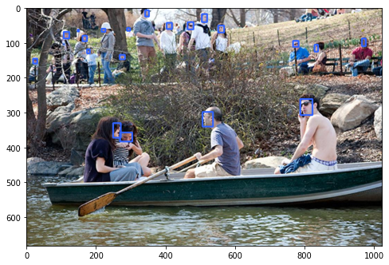

# Face_Detection_Yolo5

In this project, I fine-tuned a ```YoloV5``` Network to detect a boundary box around a face in the input picture.

I used [Wider_Face](http://shuoyang1213.me/WIDERFACE/) for this project. You can use download accelerator commands,```gdown```, to download your dataset into your ```colab``` . 
make sure that you have updated your ```gdown``` using ```!pip install -U gdown```

## Dataset Preprocessing
First I tend to change the format of boundary boxes to ```Yolo``` Format. For this, first, read each line of the dataset's labels and by calculation, extract the centre of a BBox and its height and weight. then write them into a file.



## Training
First, ```clone``` the [Yolo_Repository](https://github.com/ultralytics/yolov5) to your ```colab``` and then use ```%cd /content/yolov5``` to change your directory. In the next level, you must define a ```yaml``` file. Since it was easy, I did this manually, You can copy the ```WiderFace.yaml``` file into the ```data``` folder, once you cloned the ```YoloV5``` repository.
if you want to make the ```yaml``` file manually, first make a new file and name it as ```WiderFace.yaml```. then copy the following text in the file:
```
train: /content/newDataset/images/train
val: /content/newDataset/images/val

# number of classes 
nc: 1

# class names
names: ['face']
```

in the first two line, you specify the ```training``` and ```validation``` dataset path. and after that, you define the number of classed you want to detect, which is one here, and then you define the name of your classes.

after defining the ```yaml``` file, use the following script to train the Yolo:
```
!python train.py\
 --img 640 --batch 16\
  --epochs 2 --data /content/yolov5/data/WiderFace.yaml\
   --weights yolov5s.pt\
    --cfg yolov5s.yaml 
```
